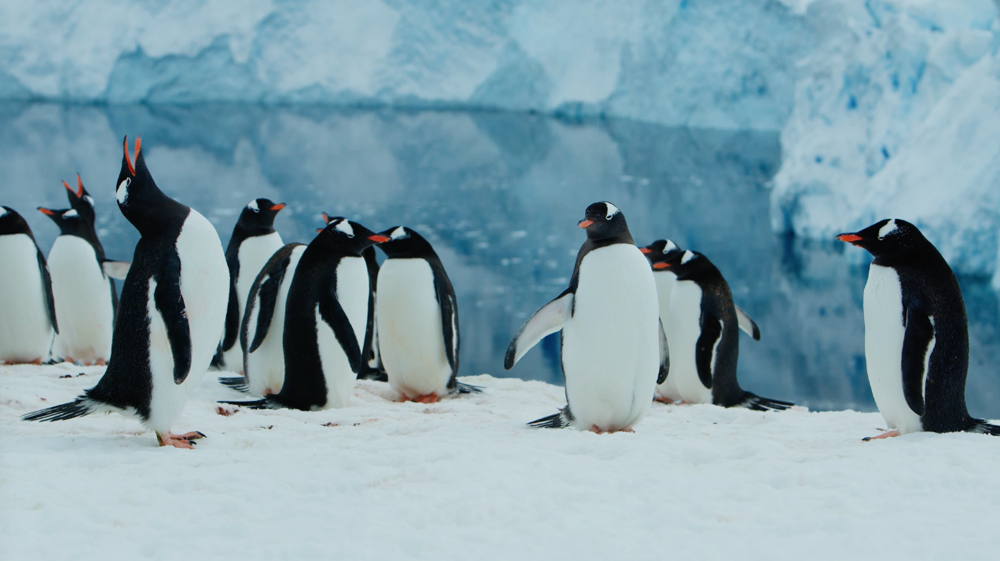

## Introduction
While global warming has been a popular topic over the last decade, we have not given enough attention to its impact on other animals, specifically those that inhabit cold areas like penguins! As you may know, penguins live in the Southern Hemisphere, primarily in Antarctica, South Africa, and Australia. In this data story, we primarily decided to focus on the penguin population based in Antarctica.
We are particularly interested in understanding how global warming affects these adorable penguins. We aim to confirm the statements we found on Google using the data we collected. To ensure we cover all possible perspectives, we have divided our study into two main sections, each with subsections that provide a comprehensive overview of the data.
In the first perspective we want to visualize is the decrease in penguin habitat due to global warming. In this visualization, we will explore the development of iceberg characteristics and the specific impact of global warming on Antarctica over the years.

Of course, the reduction of the penguin habitat does not come without consequences. The reduction of living space means that the penguins will not be able to breed on melting icebergs. That being said, there are also penguin species that cannot survive without land. Therefore, with the risk of global warming and rising sea levels, there is a chance that some penguin species become endangered as a result of global warming.

So in the second perspective we aim to visualize is whether the reduction in penguin habitat leads to a decline in the penguin population. Our question here is whether the penguin population is at risk of becoming endangered in the future. With this perspective, we hope to conclude that it is still too early to declare the penguin population as endangered.

Source: https://artlist.io/stock-footage/clip/penguin-gentoo-antarctic-colony/591826

## Dataset and Preprocessing
We used the following datasets in this data story:
### Dataset 1: https://www.penguinmap.com/mapppd/ 

This dataset shows the number of penguins living in the certain regions of Antarctica. This dataset also describes the longitude/latitude and the several types of species that occur in the region. The dataset is dated with day, month, and year (from 1922 to 2022). The count_type is also shown for accuracy. 

This dataset holds the following variables:
- site_name
- site_id
- cammir_region
- longitude_epsg_4326
- latitude_epsg_4326
- common_name
- day
- month
- year
- season_starting
- penguin_count
- accuracy
- count_type
- vantage
- reference

The following changes were made to this dataset:
- Filter year from 2002 to 2020
- Grouping by year
- Fixed missing years on certain sites, we interpolated
- Picked data based on penguin and site combination

### Dataset 2: https://www.kaggle.com/datasets/sevgisarac/temperature-change

The dataset contains the mean surface temperature change by country, with annual updates. The data covers the period between 1961 and 2020 and contains monthly, seasonal, and annual temperature changes with respect to a baseline climatology, corresponding to the period between 1951 and 1980. The temperature changes are measured in Celsius. 

This dataset holds the following variables:
- Domain Code
- Domain
- Area Code (FAO)
- Area
- Element Code
- Element
- Months Code
- Months
- Year Code
- Year
- Unit
- Value
- Flag
- Flag Description

The following changes were made to this dataset:
- Filtered each country except Antarctica

### Dataset 3: https://www.kaggle.com/datasets/douglas426/antarctica-temperature 

This dataset shows the temperatures in Antarctica. Based on the longitude/latitude the average, maximum, minimum temperature is shown based on the coordinates. The dataset also reports the average and minimum sea level pressures. Which you can easily correlate with the sea level dataset. The dataset also contains wind speed, visibility and data based on month and year. 

This dataset holds the following variables:
	Note that every xlsx in the dataset contains 30 columns, but some columns are all nan or 0, the columns are useless columns:
- Site number
- altitude
- longitude
- latitude
- year
- month
- Average temperature (℃)
- Average maximum temperature (℃)
- Average minimum temperature (℃)
- Extreme value of maximum temperature (℃)
- Extreme value of minimum temperature (℃)
- Days with average temperature ≥ 18 ℃
- Days with average temperature ≥ 35 ℃
- Days with average temperature ≤ 0 ℃
- Average dew point temperature (℃)
- Precipitation (mm)
- Maximum daily precipitation (mm)
- Precipitation days
- Mean sea level pressure (hPa)
- Minimum sea level pressure (hPa)
- Average station air pressure (hPa)
- Snow depth (mm)
- Average visibility (km)
- Minimum visibility (km)
- Maximum visibility (km)
- Average wind speed (knots)
- Average maximum sustained wind speed (knots)
- Daily maximum average wind speed (knots)
- Average maximum instantaneous wind speed (knots)
- Maximum instantaneous wind speed extreme value (knots)

The following changes were made to this dataset:
- All .xlsx files combined into one dataset
- Changed datatype from .xlsx to .csv
- Chinese columns translated into English
- Removed NaN values (	Days with average temperature ≥ 18 ℃ & Days with average temperature ≥ 35 ℃)

### Dataset 4: https://www.kaggle.com/datasets/eisgandar/antarctic-icebergs-weekly-reports-2019-2022 

This dataset contains information about the icebergs of Antarctica. There are different Icebergs, and every iceberg has its own information. It has weekly reports over the period August 2019 to August 2022, with a total of 110 weeks. The information of the icebergs are the length, width, latitude, and longitude. 

This dataset holds the following variables:
- Iceberg
- Length (NM)
- Width (NM)
- Latitude
- Longitude
- Remarks
- Last Update

The following changes were made to this dataset:
- Combined all .csv files into one dataset

### Dataset 5: https://www.kaggle.com/datasets/kkhandekar/global-sea-level-1993-2021 

This dataset shows the change in sea-level observed by satellites starting from 1993 until 2021. It contains information about the gaussian distribution, standard deviation, and the mean over the data with respect to 20-year TOPEX/Jason collinear mean reference. Then they also give the same rows where the Global Isostatic Adjustment is applied. 

This dataset holds the following variables:
- Year
- Total Weighted Observations 
- GMSL (Global Isostatic Adjustment (GIA) not applied) variation (mm) with respect to 20-year TOPEX/Jason collinear mean reference 
- Standard Deviation of GMSL (GIA not applied) variation estimate (mm)
- Smoothed (60-day Gaussian type filter) GMSL (GIA not applied) variation (mm) 
- GMSL (Global Isostatic Adjustment (GIA) applied) variation (mm) with respect to 20-year TOPEX/Jason collinear mean reference 
- Standard deviation of GMSL (GIA applied) variation estimate (mm)
- Smoothed (60-day Gaussian type filter) GMSL (GIA applied) variation (mm)
- Smoothed (60-day Gaussian type filter) GMSL (GIA applied) variation (mm); annual and semi-annual signal removed

The following changes were made to this dataset:
- Filtered dataset and kept year / sealevel combination (Year and Global Isostatic Adjustment (GIA) applied)

## Reflection
## Work Distribution
## Generative AI Usage
The reason for using generative tools in this data story project was to ensure that mistakes in the written text were not overlooked and to save time. The text was quickly written with typos, and little attention was given to the flow of the text. To save time, generative AI, such as ChatGPT, was used to fix these issues. However, it's important to note that ChatGPT was not used for writing the code in our data story project thus far. All code was either written manually or copied from examples in the Plotly documentation, with a few tweaks added.

Note: Sections that were adjusted with generative AI are denoted with ‘Proodread’

|Command| Input | Output |
|-|-|-|
|Can you check this text for grammar mistakes?| While global warming has been a popular topic the last decade we have not given attention to what global warming can cause to other animals. Specifically ones that like to live in cold eareas, such as penguins! As you may know Pneuins live at the south pole. Places they occur are Antarctica, South Africa and Australaia. In this data story we were really interested in how global warming affects those cute penguins. Was it really true that the penguin population was decreasing due to global warming and why? We hoped to confirm these statements that we found on Google with the data we found. To ensure we cover all possible perspective we divided it into two main persepctives and each perspective has subsections to give a better overview of the data story. The first perspective we want to visualize is to show if the penguin habitat is decreasing deu to global warming. In this visualisation we are going to show how iceberg characteristics develop and global warming specifically on Antarctica over the years. The second perspective we are wanting to visualize is whether the reduced penguin habitat makes the penguin population go down. Our question here is if the penguin population is going to be distinct in the future and so are they endagenerd? In this perspective we really hope to declare that it is still too early to declare the penguin populatiom as endangered. | "While global warming has been a popular topic over the last decade, we have not given enough attention to its impact on other animals, specifically those that inhabit cold areas like penguins! As you may know, penguins live in the South Pole, primarily in Antarctica, South Africa, and Australia. In this data story, we are particularly interested in understanding how global warming affects these adorable penguins. We aim to confirm the statements we found on Google using the data we collected. To ensure we cover all possible perspectives, we have divided our study into two main sections, each with subsections that provide a comprehensive overview of the data.The first perspective we want to visualize is the decrease in penguin habitat due to global warming. In this visualization, we will explore the development of iceberg characteristics and the specific impact of global warming on Antarctica over the years.The second perspective we aim to visualize is whether the reduction in penguin habitat leads to a decline in the penguin population. Our question here is whether the penguin population is at risk of becoming endangered in the future. With this perspective, we hope to conclude that it is still too early to declare the penguin population as endangered." |
|Correct and revise this text:| As seen in the donut pie chart, our distribution of penguin species in the dataset we used is not divided equally. The most prominent penguin species that occur in our dataset is the Adélie penguin, followed by the Chinstrap, Emperor, Gentoo, Macaroni and King penguin. Each penguin species is also labeled with the fitting percentage, to get a better overview of the divided species | The donut pie chart reveals that the distribution of penguin species in our dataset is not equal. The Adélie penguin stands out as the most prominent species, followed by the Chinstrap, Emperor, Gentoo, Macaroni, and King penguin. Each species is labeled with the corresponding percentage, providing a clearer overview of the distribution among the different species. |
|Correct and revise this text:| In this bar plot the sum of total penguin count is visualised. As you can see we took the data based on the years 2002 till 2020, as these were the years that had no gap in the data between the years. Each year the penguin population slight rises. As seen it goes well with the penguin population. | This bar plot visualizes the total count of penguins. The data is derived from the years 2002 to 2020, which were selected due to the absence of any data gaps between those years. It is evident that the penguin population shows a slight increase each year, aligning well with the overall trend. |
|Correct and revise this text:| What stands out in this plot is that the sea level keeps rising each year with some fluctuations. Besides the rising of the sea level the population of the chinstrap decreases, also with some fluctuations. The decrease wat somewhat little between the time stamp of 2002 till 2008, from then the chinstrap penguin population started decreasing with a high fall. | One notable observation in this plot is the consistent rise in sea level each year, accompanied by certain fluctuations. In addition to the rising sea level, there is a noticeable decline in the population of chinstrap penguins, also exhibiting some fluctuations. Initially, the decline was relatively small between 2002 and 2008. However, starting from that point, the chinstrap penguin population experienced a significant drop. |